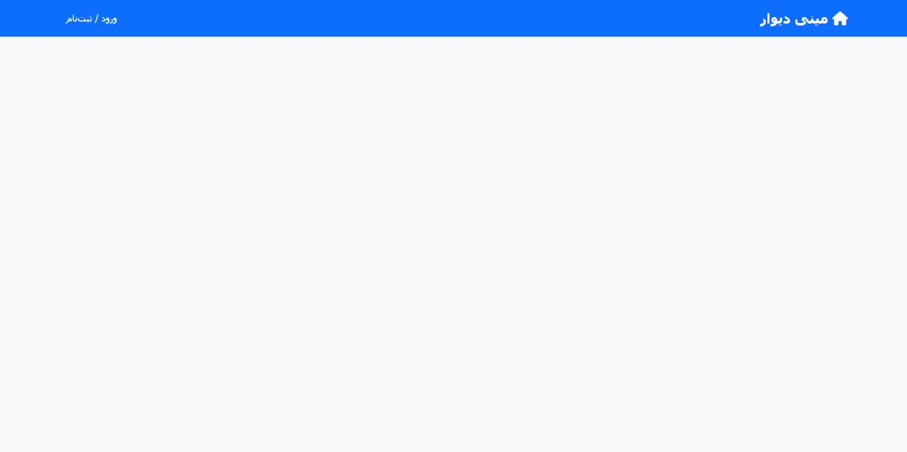

<!-- ===================================================== -->
<p align="center">
  
</p>
<!-- ===================================================== -->

<h1 align="center">🪧 MiniDivar Project</h1>

<p align="center">
  نسخه‌ی ساده و آموزشی از وبسایت دیوار با استفاده از فریم‌ورک <b>Laravel 12</b>
</p>

---

## 🧩 درباره پروژه
یک وب‌اپلیکیشن آگهی آنلاین مشابه دیوار، برای ثبت، مشاهده و مدیریت آگهی‌ها توسط کاربران و مدیران سایت.  
این پروژه با هدف تمرکز بر عملکردهای اصلی و رابط کاربری واکنش‌گرا طراحی شده است.

---
## 🚀 ویژگی‌ها
- ثبت‌نام و ورود کاربران با نقش‌های کاربر عادی و مدیر  
- ثبت آگهی با امکان آپلود چند تصویر  
- تأیید یا رد آگهی‌ها توسط مدیر  
- جستجو و فیلتر پیشرفته آگهی‌ها  
- تماس با صاحب آگهی از طریق فرم پیام  
- دسته‌بندی موضوعی شامل ۸ دسته اصلی و زیرمجموعه‌ها  

---

## 🛠️ فناوری‌ها
- Frontend: HTML, CSS, Bootstrap 5  
- Backend: Laravel (PHP)  
- Database: MySQL  
- File Upload: Laravel Storage    
- Version Control: Git + GitHub  

---

<details>
  <summary><b>🗺️ ERD (نمودار پایگاه‌داده)</b></summary>
  <br>

  <!-- ===================================================== -->

  <p align="center">
    
  </p>
  <!-- ===================================================== -->

  <p align="center">ارتباط بین جداول users، ads، categories، images و messages در MiniDivar</p>
</details>

---

<details>
  <summary><b>⚙️ پیش‌نیازهای نصب</b></summary>
  <br>

برای اجرای پروژه، نیاز به ابزارهای زیر داری 👇

| ابزار             | توضیح | لینک نصب |
  |-------------------|--------|------------------|
| **PHP >= 8.2.12** | زبان برنامه‌نویسی اصلی لاراول | [php.net/downloads](https://www.php.net/downloads) |
| **Composer >= 2.8.12** | مدیر وابستگی‌های PHP | [getcomposer.org/download](https://getcomposer.org/download) |
| **XAMPP**         | محیط اجرا و دیتابیس MySQL | [apachefriends.org/download.html](https://apachefriends.org/download.html) |
| **Node.js + npm** | برای اجرای Vite و مدیریت assetها | [nodejs.org](https://nodejs.org/en/download/) |
| **Git**  | برای مدیریت نسخه‌ها | [git-scm.com/downloads](https://git-scm.com/downloads) |

  # دستورات نصب سریع
  # نصب composer (در لینوکس)
  ```bash
  sudo apt install composer
   ```
  # نصب Node.js و npm
  ```bash
  sudo apt install nodejs npm
```
  # بررسی نسخه‌ها
  ```bash

  php -v
  composer -V
  npm -v
  ```
</details>
<details> <summary><b>🚀 راه‌اندازی اولیه پروژه</b></summary> <br>
مراحل راه‌اندازی پروژه پس از کلون کردن:


# 1️⃣ کلون یا دانلود پروژه
git clone https://github.com/SajadRamezani2002/miniDivar.git
```bach
cd minidivar
```
# 2️⃣ نصب وابستگی‌ها
```bach
composer install
npm install
```
# 3️⃣ ساخت فایل env
cp .env.example .env

# 4️⃣ تنظیمات پایگاه‌داده در فایل .env
DB_CONNECTION=mysql

DB_DATABASE=minidivar

# 5️⃣ ساخت جداول پایگاه‌داده
```bach
php artisan migrate
```

# 7️⃣ درج داده‌های تستی
```bach
php artisan db:seed
```
# 8️⃣ اجرای سرور محلی
```bach
php artisan serve
```


</details>
<details> <summary><b>🗃️ ساخت جداول با Migration</b></summary> <br>
جداول اصلی پروژه با دستورهای زیر ساخته شدند:

```bash
php artisan make:migration create_ads_table
php artisan make:migration create_categories_table
php artisan make:migration create_images_table
php artisan make:migration create_messages_table
php artisan make:migration add_role_and_phone_to_users_table
```
سپس با دستور زیر ایجاد شدند:

```bash
php artisan migrate
```
در مجموع جداول زیر وجود دارند:

users → اطلاعات کاربران

ads → اطلاعات آگهی‌ها

categories → دسته‌بندی آگهی‌ها

images → تصاویر مربوط به آگهی‌ها

messages → پیام‌های کاربران

</details>
<details> <summary><b>🌱 داده‌های اولیه (Seeder)</b></summary> <br>
داده‌های اولیه برای تست:

```bash
php artisan make:seeder UserSeeder
```
و در UserSeeder.php اضافه شدند:

```php

public function run(): void
{
    $this->call([
        UserSeeder::class,
        CategorySeeder::class,
    ]);
}
```
اجرای Seeder:

```bash
Copy code
php artisan db:seed
```
</details>
🧱 ساختار پروژه (MVC)
```
app/
 ├── Models/          → مدل‌ها (User, Ad, Category, ...)
 │
database/
 ├── migrations/      → فایل‌های ساخت جداول
 ├── seeders/         → داده‌های اولیه
resources/
 ├── views/           → فایل‌های Blade
routes/
 └── web.php          → مسیرهای وب
```

<p align="center">🧡 Developed with Laravel 12</b></p> ```
