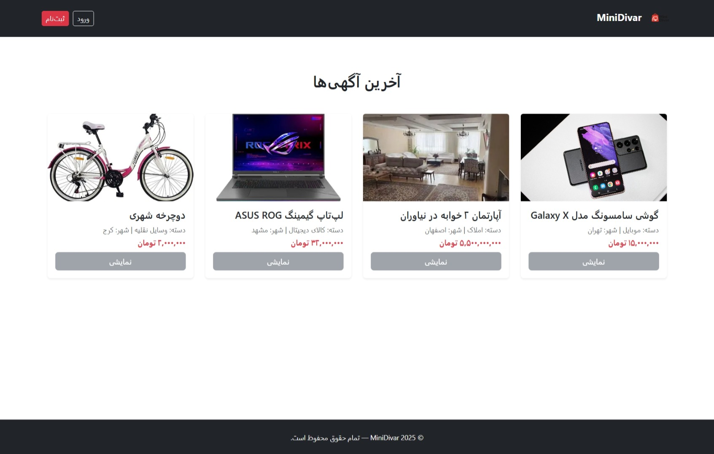

<!-- ===================================================== -->
<p align="center">
  
</p>
<!-- ===================================================== -->

<h1 align="center">🪧 MiniDivar Project</h1>

<p align="center">
  نسخه‌ی ساده و آموزشی از وبسایت دیوار با استفاده از فریم‌ورک <b>Laravel 12</b>
</p>

---

## 🧩 درباره پروژه
MiniDivar یک نسخه‌ی ساده و آموزشی از سایت دیوار است که با فریم‌ورک Laravel ساخته شده.  
هدف پروژه، تمرکز بر مفاهیم اصلی توسعه‌ی وب (MVC، احراز هویت، نقش‌ها، مدیریت داده و Blade Layouts) است.

کاربران می‌توانند آگهی ثبت کنند، و مدیران (ادمین‌ها) قادرند آگهی‌ها را مدیریت، تأیید یا رد کنند.  
ظاهر سایت با Bootstrap 5 و طراحی واکنش‌گرا ساخته شده است.

---

## 🚀 ویژگی‌ها
- ثبت‌نام و ورود کاربران با Laravel Jetstream + Fortify
- نقش‌های کاربر عادی و مدیر (Role-Based Access)
- داشبورد مجزا برای کاربران و مدیران
- مدیریت کاربران توسط ادمین (تغییر نقش کاربر ↔ ادمین)
- ثبت و نمایش آگهی‌ها با اطلاعات دسته، قیمت و شهر
- تأیید، رد و حذف آگهی‌ها توسط مدیر
- دسته‌بندی آگهی‌ها با CategorySeeder
- چند آگهی نمایشی در صفحه‌ی اصلی برای کاربران مهمان
- رابط کاربری واکنش‌گرا با Bootstrap 5
- استفاده از Layoutهای Blade برای مدیریت بخش‌های تکراری مثل Header و Footer

---

## 🛠️ فناوری‌های استفاده‌شده
- **Backend:** Laravel 12 (PHP 8.2.12)
- **Frontend:** HTML5, CSS3, Bootstrap 5
- **Database:** MySQL
- **Auth System:** Laravel Fortify + Jetstream (با Livewire)
- **ORM:** Eloquent
- **Version Control:** Git + GitHub

---

<details>
  <summary><b>🗺️ ERD (نمودار پایگاه‌داده)</b></summary>
  <br>

  <p align="center">
    
  </p>

  <p align="center">ارتباط بین جداول users، ads، categories، images و messages در MiniDivar</p>
</details>

---

<details>
  <summary><b>⚙️ پیش‌نیازهای نصب</b></summary>
  <br>

برای اجرای پروژه، نیاز به ابزارهای زیر داری 👇

| ابزار             | توضیح | لینک نصب |
|-------------------|--------|------------------|
| **PHP >= 8.2.12** | زبان برنامه‌نویسی اصلی لاراول | [php.net/downloads](https://www.php.net/downloads) |
| **Composer >= 2.8.12** | مدیر وابستگی‌های PHP | [getcomposer.org/download](https://getcomposer.org/download) |
| **XAMPP**         | محیط اجرا و دیتابیس MySQL | [apachefriends.org/download.html](https://apachefriends.org/download.html) |
| **Node.js + npm** | برای اجرای Vite و مدیریت assetها | [nodejs.org](https://nodejs.org/en/download/) |
| **Git**  | برای کنترل نسخه‌ها | [git-scm.com/downloads](https://git-scm.com/downloads) |

### 🧰 دستورات نصب سریع
```bash
# نصب composer (در لینوکس)
sudo apt install composer

# نصب Node.js و npm
sudo apt install nodejs npm

# بررسی نسخه‌ها

php -v
composer -V
npm -v


</details>

---

<details>
  <summary><b>🚀 راه‌اندازی اولیه پروژه</b></summary>
  <br>

```bash
# 1️⃣ کلون یا دانلود پروژه
git clone https://github.com/SajadRamezani2002/miniDivar.git
cd miniDivar

# 2️⃣ نصب وابستگی‌ها
composer install
npm install

# 3️⃣ ساخت فایل env و تنظیمات دیتابیس
cp .env.example .env
```

در فایل `.env` مقدارهای زیر را تنظیم کن:

```bash
DB_CONNECTION=mysql
DB_DATABASE=minidivar
DB_USERNAME=root
DB_PASSWORD=
```

```bash
# 4️⃣ ساخت جداول پایگاه‌داده
php artisan migrate

# 5️⃣ درج داده‌های اولیه (Seeder)
php artisan db:seed

# 6️⃣ اجرای سرور محلی
php artisan serve
```

📍 حالا با آدرس زیر سایت را باز کن:

```
http://127.0.0.1:8000
```

</details>

---

<details>
  <summary><b>🗃️ ساخت جداول با Migration</b></summary>
  <br>

جداول اصلی پروژه با دستورات زیر ساخته شدند:

```bash
php artisan make:migration create_ads_table
php artisan make:migration create_categories_table
php artisan make:migration create_images_table
php artisan make:migration create_messages_table
php artisan make:migration add_role_and_phone_to_users_table
```

سپس همه با دستور زیر ایجاد شدند:

```bash
php artisan migrate
```

**لیست جداول:**

| جدول         | توضیح                                             |
| ------------ | ------------------------------------------------- |
| `users`      | اطلاعات کاربران (نام، ایمیل، تلفن، نقش، رمز عبور) |
| `ads`        | آگهی‌ها (عنوان، توضیحات، قیمت، شهر، دسته، وضعیت)  |
| `categories` | دسته‌بندی‌ها و زیرمجموعه‌ها                       |
| `images`     | تصاویر هر آگهی                                    |
| `messages`   | پیام‌های کاربران برای صاحبان آگهی‌ها              |

</details>

---

<details>
  <summary><b>🌱 داده‌های اولیه (Seeder)</b></summary>
  <br>

### Seederهای ساخته شده:

```bash
php artisan make:seeder UserSeeder
php artisan make:seeder CategorySeeder
```

در `DatabaseSeeder.php` فراخوانی شدند:

```php
public function run(): void
{
    $this->call([
        UserSeeder::class,
        CategorySeeder::class,
    ]);
}
```

اجرای Seeder:

```bash
php artisan db:seed
```

**کاربران نمونه:**

| نام                 | ایمیل                                               | نقش   |
| ------------------- | --------------------------------------------------- | ----- |
| Admin User          | [admin@minidivar.test](mailto:admin@minidivar.test) | admin |
| Test User           | [test@minidivar.test](mailto:test@minidivar.test)   | user  |
| چند کاربر تستی دیگر | (با Faker)                                          | user  |

نمایش کاربران در Tinker:

```bash
php artisan tinker
App\Models\User::all(['id','name','email','role'])->toArray();
```

</details>

---

<details>
  <summary><b>🧱 ساختار پروژه (MVC)</b></summary>
  <br>

```text
app/
 ├── Models/               → مدل‌ها (User, Ad, Category, Image, Message)
 ├── Http/
 │   ├── Controllers/      → کنترلرها (AdController, AdminController, UserDashboardController)
 │   ├── Middleware/       → middlewareها (IsAdmin)
 │   └── Kernel.php        → ثبت middlewareها
database/
 ├── migrations/           → فایل‌های ساخت جداول
 ├── seeders/              → داده‌های اولیه
resources/
 ├── views/                → قالب‌های Blade (ads/, dashboard/, layouts/)
 ├── views/layouts/        → فایل‌های app.blade.php, header.blade.php, footer.blade.php
routes/
 └── web.php               → مسیرهای اصلی وب
```

</details>

---

## ⚡ عملکردهای انجام‌شده تا این مرحله

✅ **فاز ۱ – تحلیل و طراحی اولیه**

* طراحی ERD کامل برای users، ads، categories، images، messages
* انتخاب فناوری‌ها (Laravel + MySQL + Bootstrap)
* ساخت README اولیه و Git setup

✅ **فاز ۲ – پیاده‌سازی پایگاه‌داده و ساختار اولیه**

* ایجاد جداول با migration
* ساخت مدل‌ها و روابط بین آن‌ها
* کنترلر اولیه برای آگهی‌ها (`AdController`)
* صفحه اصلی (`ads/index.blade.php`)

✅ **فاز ۳ – ثبت‌نام و ورود کاربران**

* پیاده‌سازی Fortify و Jetstream با Livewire
* فرم‌های login و register فعال
* هش رمزها و اعتبارسنجی کاربران
* نقش پیش‌فرض: `user`
* ادمین اولیه با Seeder ساخته شد

✅ **فاز ۴ – نقش‌ها و داشبوردها**

* ساخت Middleware `IsAdmin`
* جداسازی مسیرهای ادمین و کاربر
* ساخت کنترلرهای `AdminController` و `UserDashboardController`
* طراحی صفحات `dashboard/admin.blade.php` و `dashboard/user.blade.php`
* افزودن دکمه‌ی "ادمین کن / کاربر کن" در لیست کاربران
* نمایش آمار (کل آگهی‌ها، کاربران، وضعیت‌ها) در داشبورد ادمین

✅ **فاز ۵ – ظاهر و Layout**

* طراحی فایل‌های `header.blade.php` و `footer.blade.php`
* تنظیم ساختار لایه‌ای با `app.blade.php`
* اتصال Bootstrap به‌صورت آفلاین
* نمایش چند آگهی نمونه در صفحه اصلی

---

<p align="center">🧡 Developed with Laravel 12</p>
```

---
